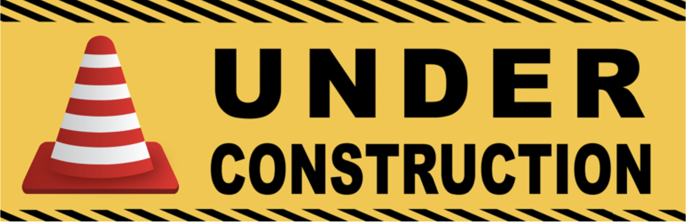

# Guess My Number 

Under Construction Project 

### Important link here 
 Future link Here

## Technologies use 

- 

- 

- 

### Set Up Installation Instruction 

- Download or clone Repositories 

-  Run Server 

Run the app in the development mode. Open localhost to view in the browser.
Page reload each tim you make edits. You will also see any lint errors in the console.

